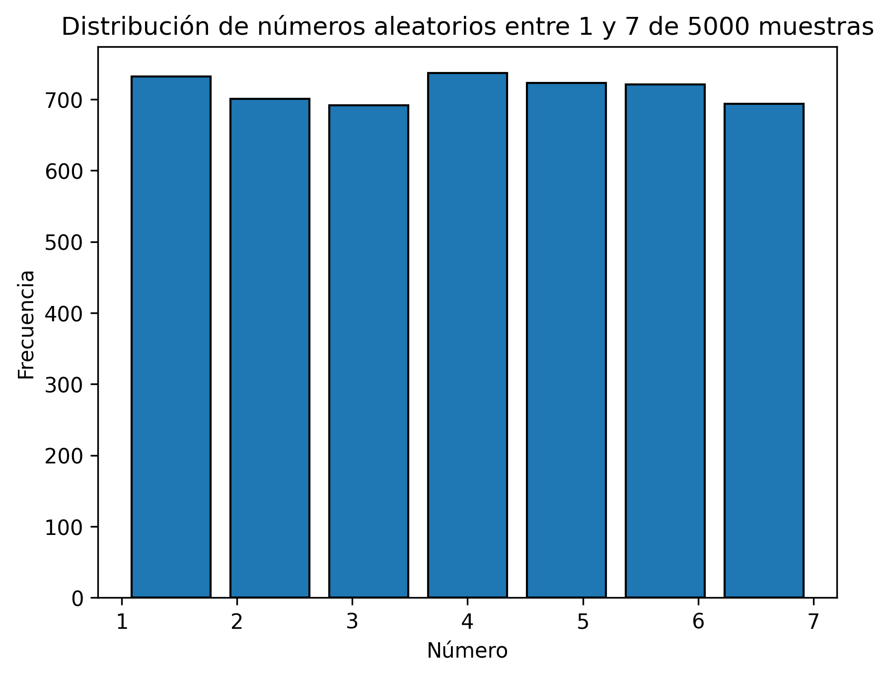

# Generador de Números Aleatorios 1-7

Proyecto que implementa un generador de números aleatorios del 1 al 5 sin usar librerías estándar de aleatoriedad, y lo extiende recursivamente para generar números del 1 al 7 mediante el método de rechazo (rejection sampling).

## ¿Por qué Python?

Se eligió Python por:
- Visualización simple
- Desarrollo rápido
- Foco en la lógica

## Instalación

### Requisitos previos
- Python 3.7 o superior

### Instalar dependencias
```bash
pip install matplotlib
```

## Ejecución
```bash
python generador.py
```

Esto generará 5000 números aleatorios del 1 al 7 y mostrará un histograma con su distribución.

## Implementación

### Generador LCG (Linear Congruential Generator)

Se utiliza un **LCG** para generar números pseudoaleatorios base (1-5) porque ayuda a evitar el sesgo que produce usar `time.time_ns()` en llamadas consecutivas rápidas.

**Parámetros del LCG (glibc)**:
- **a = 1103515245**: Multiplicador que dispersa los valores
- **c = 12345**: Incremento que evita ciclos cortos
- **m = 2³¹**: Módulo que limita el rango

Fórmula: `semilla_nueva = (a × semilla_actual + c) mod m`

### Extensión recursiva 1-7

Se usa el método de **rejection sampling**:
1. Genera un número del 1-25 usando dos llamadas a `random_5()`
2. Si el número está entre 1-21, lo mapea al rango 1-7
3. Si está entre 22-25, rechaza y vuelve a intentar (recursión)

Esto garantiza una distribución uniforme perfecta.

## Resultados

Histograma con 5000 muestras:

